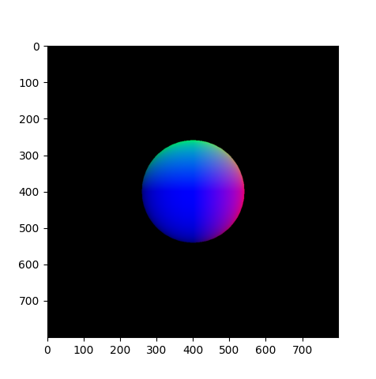
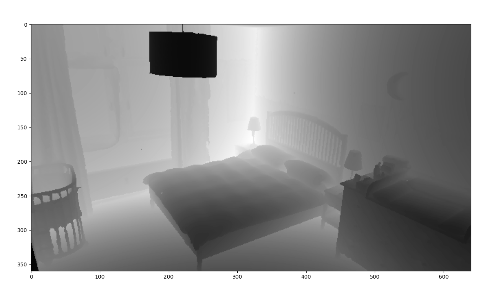

# Triro - An in-place replacement for trimesh.ray in Optix

Triro is a [trimesh.ray](https://trimesh.org/trimesh.ray.html) implementation using NVIDIA Optix.

## 🔧️ Installation
First
```sh
export OptiX_INSTALL_DIR=<Your Optix SDK install location>
```
Then
```sh
pip install git+https://github.com/lcp29/trimesh-ray-optix
```
or
```sh
git clone https://github.com/lcp29/trimesh-ray-optix
cd trimesh-ray-optix
pip install .
```
## 📖️ Example
```python
import trimesh
import matplotlib.pyplot as plt
from triro.ray.ray_optix import RayMeshIntersector

# creating mesh and intersector
mesh = trimesh.creation.icosphere()
intersector = RayMeshIntersector(mesh)

# generating rays
x, y = torch.meshgrid([torch.linspace([-1, 1, 800]), 
                       torch.linspace([-1, 1, 800])], indexing='ij')
z = -torch.ones_like(x)
ray_directions = torch.cat([x, y, z], dim=-1).cuda().contiguous()
ray_origins = torch.Tensor([0, 0, 3]).cuda().broadcast_to(ray_directions.shape).contiguous()

# Optix, Launch!
hit, front, ray_idx, tri_idx, location, uv = sr.intersects_closest(
    ray_directions, ray_directions, stream_compaction=True
)

# drawing result
locs = torch.zeros((800, 800, 3)).cuda()
locs[hit] = location
plt.imshow(locs.cpu())
plt.show()
```
The above code generates the following result:



## 🚀️ Performance Comparison

Scene closest-hit ray tracing tested with i5-13490F and RTX 3090:
```
GPU time: 8.121 s / 100000 iters
Trimesh & PyEmbree CPU time: 19.454 s / 100 iters
speedup: 2395x
```



## 🔍️ Documentation

The Trimesh document is [here](https://trimesh.org/trimesh.ray.html).

### triro.ray.ray\_optix.RayMeshIntersector

Wrapper for `trimesh.Trimesh`, Optix device acceleration structure handlers and intersect functions.

#### RayMeshIntersector.\_\_init\_\_(mesh)

##### Parameters

**mesh**: `trimesh.Trimesh` object used to initialize Optix acceleration structures. 

#### RayMeshIntersector.intersects_any(origins, directions)

Returns if the rays hit anything.

##### Parameters

**origins**: `[*b, 3]` float tensor of ray origins, `*b` means any dimensions.

**directions**: `[*b, 3]` float tensor of ray directions.

##### Returns

`[*b]` bool tensor indicating if the ray hit anything.

#### RayMeshIntersector.intersects_first(origins, directions)

Returns the index of the first triangle the ray hits.

##### Returns

`[*b]` int tensor of the first triangle indices.

#### RayMeshIntersector.intersects_closest(origins, directions, stream_compaction=False)

Returns a tuple of tensors indicating the closest hits:
 - **hit**: if the ray hits any triangle;
 - **front**: if the ray hits the front side;
 - **ray_idx**: hit ray index;
 - **tri_idx**: hit triangle index;
 - **loc**: hit location;
 - **uv**: hit triangle uv.

##### Parameters

**stream_compaction**: whether to perform stream compaction on the result.

##### Returns

When `stream_compaction is False`:

`hit[*b], front[*b], tri_idx[*b], loc[*b, 3], uv[*b, 2]`, all value initialized zero.

When `stream_compaction is True`:

`hit[*b], front[h], ray_idx[h], tri_idx[h], loc[h, 3], uv[h, 2]`, where `h` is number of hit rays.

#### RayMeshIntersector.intersects_location(origins, directions)

Returns hit locations, ray indices and triangle indices of possibly multiple hits per ray.

The maximum hit per ray is limited by `MAX_ANYHIT_SIZE` in LaunchParams.h; the default value is 8.

##### Returns

`loc[h 3], ray_idx[h], tri_idx[h]`

#### RayMeshIntersector.intersects_count(origins, directions)

Returns hit count per ray.

##### Returns

`hit_count[*b]` int tensor for hit count per ray.

#### RayMeshIntersector.intersects_intersects_id(origins, directions, return_locations=False, multiple_hits=True)

Returns triangle indices and hit locations.

*When enabling multiple hits, it is not guaranteed that the closest intersection will be returned.*

##### Parameters

**return_locations**: whether return hit locations.

**multiple_hits**: whether enable multiple hits.

##### Returns

When `return_locations is True`:

`tri_idx[h], ray_idx[h]`

When `return_locations is False`:

`tri_idx[h], ray_idx[h], loc[h, 3]`

#### RayMeshIntersector.contains_points(points)

Returns if the points are inside the mesh.

##### Parameters

**points**: `[*b, 3]` float tensor of input points

##### Returns

`[*b]` bool tensor indicating if the point is inside the mesh.

